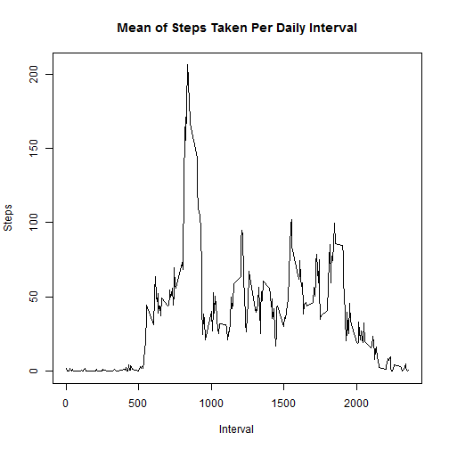

# Reproducible Research: Peer Assessment 1


## Loading and preprocessing the data

```r
setwd("~/Coursera/Reproducible Research/RepData_PeerAssessment1")
library(ggplot2)
library(lattice)
library(plyr)
activity <- read.csv(unz("activity.zip", "activity.csv"))
daily <- aggregate(steps ~ date, data = activity, FUN = "sum")
interval <- aggregate(steps ~ interval, data = activity, FUN = "mean")
```


## What is mean total number of steps taken per day?

```r
hist(daily$steps, main = "Histogram of Steps Per Day", xlab = "Steps Per Day")
```

 

```r
stepsMean <- mean(daily$steps)
stepsMedian <- median(daily$steps)
```


The mean number of steps per day is 1.0766 &times; 10<sup>4</sup> and the median number per day is 10765


## What is the average daily activity pattern?


```r
plot(interval$interval, interval$steps, type = "l", ylab = "Steps", xlab = "Interval", 
    main = "Mean of Steps Taken Per Daily Interval")
```

 

```r
maxInterval <- interval[which.max(interval$steps), "interval"]
```

The interval with the largest average number of steps per day is 835

## Imputing missing values

There are a number of records with missing values. The table below shows
the rows with complete cases so the total number of rows
with missing values is under "FALSE".


```r
table(complete.cases(activity))
```

```
## 
## FALSE  TRUE 
##  2304 15264
```


Next, create a dataset that imputes values for the missing values by
using the average number of steps per interval.


```r
imputed <- ddply(activity, .(interval), function(activity) {
    activity$steps[is.na(activity$steps)] <- mean(activity$steps, na.rm = TRUE)
    return(activity)
})
dailyImputed <- aggregate(steps ~ date, data = imputed, FUN = "sum")
hist(dailyImputed$steps, main = "Histogram of Steps Per Day", xlab = "Steps Per Day")
```

 

```r
stepsMeanImputed <- mean(dailyImputed$steps)
stepsMedianImputed <- median(dailyImputed$steps)
stepsMeanDiff <- stepsMeanImputed - stepsMean
stepsMedianDiff <- stepsMedianImputed - stepsMedian
```


Using the new imputed dataset, the mean number of steps per day is 1.0766 &times; 10<sup>4</sup> which differs from the original mean by 0.  

Using the new imputed dataset, the  median number per day is 1.0766 &times; 10<sup>4</sup> which differs from the original mean by 1.1887.  


## Are there differences in activity patterns between weekdays and weekends?

```r
imputed$date <- strptime(imputed$date, format = "%Y-%m-%d")
imputed$weekday <- weekdays(imputed$date)
imputed$weekdayGroup <- ifelse(imputed$weekday %in% c("Saturday", "Sunday"), 
    "Weekend", "Weekday")
intervalWeekday <- aggregate(steps ~ interval * weekdayGroup, data = imputed, 
    FUN = "mean")
xyplot(intervalWeekday$steps ~ intervalWeekday$interval | intervalWeekday$weekdayGroup, 
    t = "l", xlab = "Interval", ylab = "Steps", main = "Mean of Steps Taken Per Daily Interval With Imputed Data")
```

 

